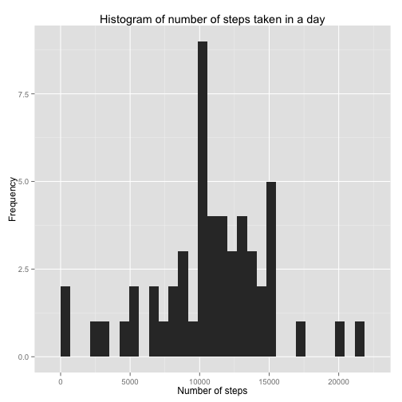
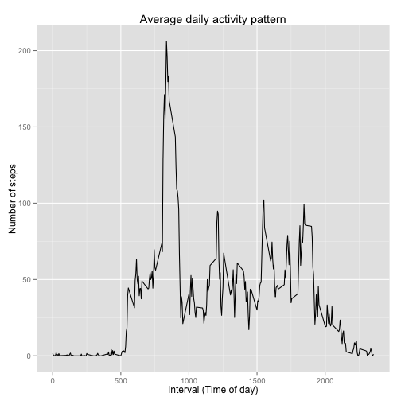
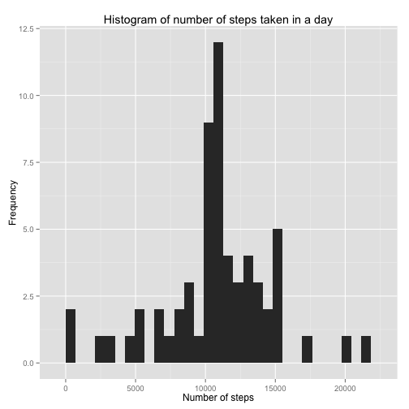
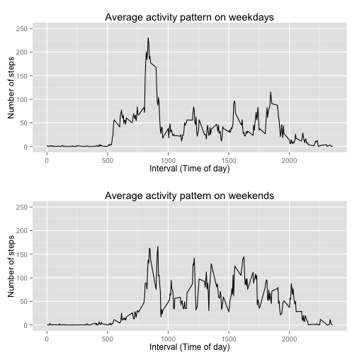

```r
library(dplyr)
library(ggplot2)
library(gridExtra)
```

## Loading and preprocessing the data


```r
activity <- read.csv("activity.csv")
activityByDay <- group_by(activity, date)
activityByInterval <- group_by(activity, interval)
```

## What is mean total number of steps taken per day?


```r
stepsByDay <- summarise(activityByDay, dailySteps = sum(steps, na.rm = FALSE))
qplot(stepsByDay$dailySteps, 
      geom = "histogram",
      main = "Histogram of number of steps taken in a day",
      xlab = "Number of steps",
      ylab = "Frequency")
```

 

Mean number of steps taken per day:

```r
mean(stepsByDay$dailySteps, na.rm = TRUE)
```

```
## [1] 10766.19
```


Median number of steps taken per day:

```r
median(stepsByDay$dailySteps, na.rm = TRUE)
```

```
## [1] 10765
```

## What is the average daily activity pattern?


```r
stepsByInterval <- summarise(activityByInterval, intervalSteps = mean(steps, na.rm = TRUE))
qplot(stepsByInterval$interval,
      stepsByInterval$intervalSteps,
      geom = "line",
      main = "Average daily activity pattern",
      xlab = "Interval (Time of day)",
      ylab = "Number of steps")
```

 


This is the 5-minute interval that contains the maximum number of steps on average:

```r
stepsByInterval$interval[which.max(stepsByInterval$intervalSteps)]
```

```
## [1] 835
```


## Imputing missing values

The total number of missing values in the dataset:

```r
sum(is.na(activity$steps) | is.na(activity$date) | is.na(activity$interval))
```

```
## [1] 2304
```


The following code fills in the missing values in the dataset using the mean for the corresponding 5-minute interval:

```r
for (i in 1:nrow(activity)){
  if (is.na(activity$steps[i])){
    activity$steps[i] <- stepsByInterval$intervalSteps[stepsByInterval$interval == activity$interval[i]]
  }
}
```

Here's a new histogram of the total number of steps taken each day using the imputed data:

```r
activityByDay <- group_by(activity, date)
stepsByDay <- summarise(activityByDay, dailySteps = sum(steps, na.rm = FALSE))
qplot(stepsByDay$dailySteps, 
      geom = "histogram",
      main = "Histogram of number of steps taken in a day",
      xlab = "Number of steps",
      ylab = "Frequency")
```

 

As you can see from the following mean and median total number of steps taken per day, these values are very similar to the estimates above (which ignored the missing data).

```r
mean(stepsByDay$dailySteps, na.rm = TRUE)
```

```
## [1] 10766.19
```

```r
median(stepsByDay$dailySteps, na.rm = TRUE)
```

```
## [1] 10766.19
```

## Are there differences in activity patterns between weekdays and weekends?


```r
activity <- mutate(activity,
                   dayOfWeek = factor("weekday"))
levels(activity$dayOfWeek) <- c("weekday", "weekend")
for (i in 1:nrow(activity)){
  if (weekdays(as.Date(activity$date[i])) %in% c("Saturday", "Sunday")){
    activity$dayOfWeek[i] <- factor("weekend")
  }
}

activityByWeekday <- group_by(activity, dayOfWeek, interval)

stepsOnWeekday <- activityByWeekday %>%
  filter(dayOfWeek == "weekday") %>%
  summarise(intervalSteps = mean(steps, na.rm = TRUE))

weekdayPlot <- qplot(stepsOnWeekday$interval,
      stepsOnWeekday$intervalSteps,
      geom = "line",
      main = "Average activity pattern on weekdays",
      xlab = "Interval (Time of day)",
      ylab = "Number of steps",
      ymax = 250)

stepsOnWeekend <- activityByWeekday %>%
  filter(dayOfWeek == "weekend") %>%
  summarise(intervalSteps = mean(steps, na.rm = TRUE))

weekendPlot <- qplot(stepsOnWeekend$interval,
      stepsOnWeekend$intervalSteps,
      geom = "line",
      main = "Average activity pattern on weekends",
      xlab = "Interval (Time of day)",
      ylab = "Number of steps",
      ymax = 250)

grid.arrange(weekdayPlot, weekendPlot, nrow=2)
```

 
